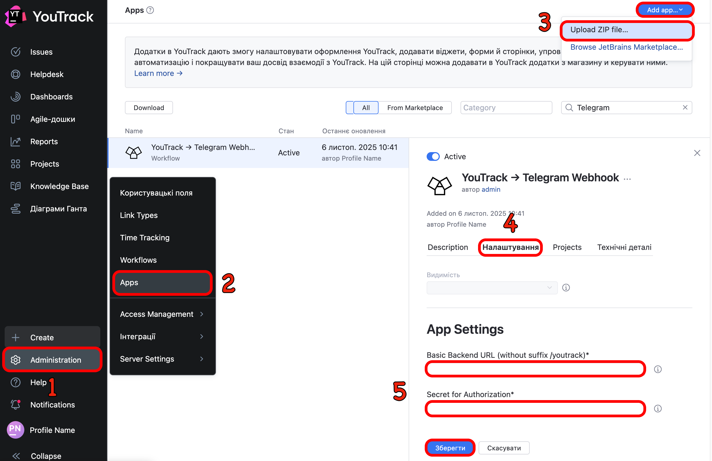
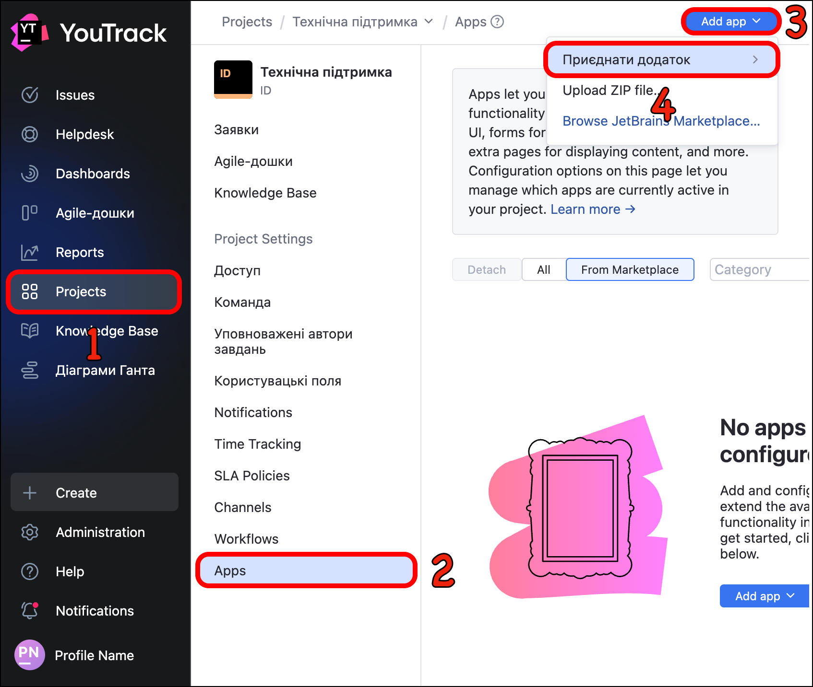

# Agromat IT-Desk Bot


> Автоматично пересилає створення заявок із YouTrack у Telegram-чат, дозволяє приймати їх через inline-кнопку та тримає звʼязок із YouTrack у синхроні.

## Огляд

- **YouTrack Automation App** (`yt2tg-app.zip`) підключається до вашого інстансу YouTrack і надсилає вебхуки про нові заявки.
- **FastAPI бекенд** приймає вебхуки, обробляє payload, підчищає HTML-опис, підставляє fallback-тему і надсилає повідомлення в Telegram.
- **Aiogram бот** у чаті показує заявку з кнопкою «Прийняти». Коли користувач приймає задачу, бот призначає її на нього в YouTrack і оновлює повідомлення.
- **SQLite** зберігає мапу «issue ↔ Telegram message», а також дані авторизованих користувачів (ID, токени, статус).

## Швидкий старт (TL;DR)

1. **Клонувати репозиторій**, створити та заповнити `.env` на базі `.env.example`.
2. **Створити virtualenv** і `pip install -r requirements.txt`.
3. **Розпакувати** `youtrack_app/yt2tg-app.zip` у `YouTrack → Administration → Apps → Add app → Upload ZIP file`, задати `WEBHOOK_BASE`, `WEBHOOK_SECRET`.
4. **Налаштувати Telegram-webhook** на `https://<ваш-сервер>/telegram` з `TELEGRAM_WEBHOOK_SECRET`.
5. **Запустити бекенд** (`uvicorn agromat_it_desk_bot.main:app --host 0.0.0.0 --port 8080`).
6. **Підʼєднати свій токен** до бота `/connect <youtrack_token>`.
7. **Додати бота** в потрібний чат/канал.

## Налаштування YouTrack Automation App

### Завантаження Automation App в YouTrack



1. Зайти в YouTrack як адміністратор → **Administration → Apps → Add app**.
2. Натиснути **Upload ZIP file**, обрати `youtrack_app/yt2tg-app.zip`.
3. Після інсталяції відкрити налаштування апки і заповнити:
    - `WEBHOOK_BASE` – базова адреса бекенда, наприклад `https://bot.example.com` (без `/youtrack`).
    - `WEBHOOK_SECRET` – той самий `YT_WEBHOOK_SECRET`, що і в `.env`.

4. **Зберегти**. Скрипт `yt2tg_create.js` почне слухати створення задач (`Issue.onChange` → `ctx.issue.becomesReported`).

### Додавання Automation App до проєкту YouTrack



1. Перейти в **Projects** та обрати потрібний проєкт.
2. Інтегрувати апку: **Apps → Add app → Upload ZIP file**.
3. Завантажити `yt2tg-app.zip` із каталогу `youtrack_app/`.

Після збереження апка почне відправляти вебхуки про створення та оновлення заявок у бекенд.

## Налаштування Telegram-бота

1. Створити бота через BotFather (`/newbot`).
2. Записати `BOT_TOKEN`.
3. Налаштувати **webhook**:

    ```bash
    curl -X POST https://api.telegram.org/bot$TOKEN/setWebhook \
    -d "url=https://bot.example.com/telegram" \
    -d "secret_token=$TELEGRAM_WEBHOOK_SECRET"
    ```

4. Додати бота в потрібний канал/чат, видати права постити повідомлення.

## Запуск бекенда

### Режим розробки

```bash
uvicorn agromat_it_desk_bot.main:app --host 0.0.0.0 --port 8080 --reload
```

## Поведінка бота

### Реєстрація та авторизація

- Користувач надсилає команду боту в особистий чат `/start`.
- Якщо користувач не привʼязаний, бот показує інструкцію та кнопку з документацією YouTrack щодо токенів.
- Команда `/connect <youtrack_token>`:
    1. Перевіряє токен через `GET /api/users/me` (функція `validate_token`).
    2. Нормалізує логін/email/id (`normalize_user`).
    3. Перевіряє членство у проєкті (`is_member_of_project`), використовуючи `YT_PROJECT_KEY`/`YT_PROJECT_ID`.
    4. Зберігає користувача у SQLite (`users` таблиця) та позначає `is_active=1`.

- `/connect` із вже зареєстрованим користувачем запускає підтвердження оновлення токена (**inline "Так/Ні"**).
- `/unlink` – видаляє токен і деактивує користувача (`is_active=0`).

### Обробка заявок

- Якщо заявка створена через **email-інтеграцію**, бекенд автоматично **очищує HTML-текст** із вхідного листа.
- Для заявок, створених **через сайт або форму**, опис надсилається **без змін**.
- Всі зображення у тексті **ігноруються**.

### Прийняття задачі та синхронізація

Після натискання кнопки "**Прийняти**" в Telegram бот:

- перевіряє, що користувач авторизований і має дійсний токен;
- призначає задачу цьому користувачу в YouTrack (оновлює поля "**виконавець**" та "**статус**");
- одразу оновлює повідомлення в чаті – змінює статус на "**В роботі**", показує виконавця та прибирає кнопку.

Далі, якщо в YouTrack вручну змінюється **статус** або **виконавець**, бекенд отримує вебхук `/youtrack/update` і **редагує те саме повідомлення в Telegram**, щоб воно залишалось синхронізованим із реальною заявкою.

## Вебхуки від YouTrack

- `/youtrack` – створення задачі: бекенд
    - нормалізує summary (fallback "Тема заявки не вказана"), очищує HTML опис,
    - логує payload з очищеним описом,
    - надсилає повідомлення в Telegram з inline-кнопкою "Прийняти",
    - зберігає `issue_id ↔ chat_id, message_id` у БД (`issue_messages`).
    - При потребі оновлює summary в самій задачі через YouTrack API.
- `/youtrack/update` – оновлення задачі: шукає `issue_id` у БД та редагує економно (включно з текстом і клавіатурою).

## Додаткові ресурси

- [ТОВ "Агромат"](https://www.agromat.ua)
- [YouTrack Automation Apps](https://www.jetbrains.com/help/youtrack/server/introduction-to-youtrack-server.html)
- [FastAPI](https://fastapi.tiangolo.com)
- [Aiogram 3.x](https://aiogram.dev)
- [Telegram Bot API](https://core.telegram.org/bots/api)
